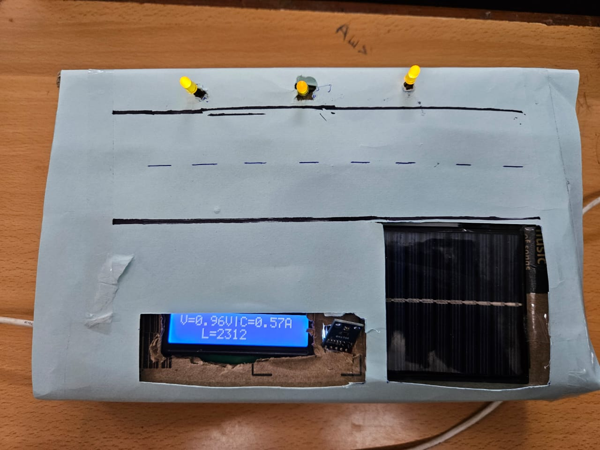

# IoT Solar Power Monitoring System with Street Light Control

## Overview

This is an IoT-based solar power monitoring system that utilizes solar panels to generate current. The project focuses on an example of a street light, which is controlled based on the light intensity using a light intensity sensor. An ESP32 development board is used for the project, along with Arduino Cloud for remote monitoring and control. Additional components used include a voltage sensor and an AC current sensor to display data on an LCD screen.

## Project Components

- **ESP32 Development Board**: The ESP32 is the core of the project, responsible for data collection, communication, and control.

- **Solar Panels**: Solar panels are used to generate current from sunlight.

- **Light Intensity Sensor**: A light intensity sensor measures the ambient light conditions, allowing the system to control the street light based on brightness.

- **Voltage Sensor**: Monitors the voltage generated by the solar panels.

- **AC Current Sensor**: Measures the AC current produced by the system.

- **LCD Screen**: Displays real-time voltage and current data.

## Project Structure

- `src/` directory contains the Arduino code for the ESP32.
- `coa2.jpg` contains a snapshot of the code used in the project.
- `coa3.jpg` shows the connections between different components.

## Getting Started

1. Clone this repository to your local environment.

2. Open the Arduino IDE, make sure you have the necessary libraries for ESP32 and Arduino Cloud installed.

3. Load the code from the `src/` directory onto your ESP32 board.

4. Connect the various components as shown in `coa3.jpg`.

5. Power up the system using the solar panels.

6. Monitor and control the system remotely using Arduino Cloud.

## Demo Video

For a practical demonstration of this project, check out the demo video:

[Watch Demo Video](coavedio1.mp4)

## Project in Action

## License

This project is open-source and available under the [MIT License](LICENSE).

Feel free to contribute, report issues, or suggest improvements. We welcome your feedback and collaboration!

## Acknowledgments

Special thanks to the open-source community, Arduino, and ESP32 for their contributions to this project.

Happy tinkering!
